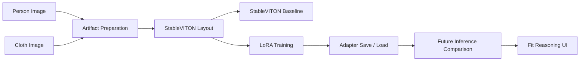

# 🧥 Fit-Reasoning VTON

StableVITON 기반 virtual try-on 결과에 fit reasoning과 confidence를 결합하기 위한 프로젝트입니다.

이 프로젝트의 목표는 사람 이미지와 의류 이미지를 입력받아 가상 착장 결과를 만들고, 단순히 이미지만 보여주는 것이 아니라 fit label, confidence score, fit explanation, hotspot annotation까지 연결 가능한 Virtual Try-On 시스템을 만드는 것입니다.

## 🎬 Demo

현재 Git에는 실제 데모 영상, 결과 이미지, checkpoint, dataset을 포함하지 않습니다.

데모 영상 링크: https://drive.google.com/drive/u/0/folders/1ohD0kGGElCdoHZPtS9bWI1p0Qaeqj_XA

<!-- TODO: Add demo flow screenshot after final video export. -->
<!-- Suggested placeholder path: assets/readme/demo_flow.png -->
<!-- Suggested result comparison path: assets/readme/model_compare_placeholder.png -->

## 🖥️ Demo UI Preview


위 화면은 Fit-Reasoning VTON의 데모용 비교 페이지입니다.  
사용자는 person image(사람 이미지), cloth image(의류 이미지), worn image(정답 착용 이미지)를 업로드한 뒤, 동일한 입력에 대해 `Target Worn`, `StableVITON`, `StableVITON LoRA` 결과를 나란히 비교할 수 있습니다.
  
상단의 `StableVITON`, `IDM VTON`, `CAT VITON` 탭은 StableVITON 중심 실험 결과를 확장하여 후속 baseline comparison을 진행하기 위한 비교 모델 후보를 나타냅니다.

## 💡 Motivation

일반적인 Virtual Try-On(VTON)은 “옷이 입혀진 이미지”를 보여주는 데 집중합니다. 하지만 실제 사용자는 다음 질문을 함께 알고 싶어 합니다.

- 생성 결과가 어느 정도 믿을 만한가?
- 핏이 타이트한지, 레귤러한지, 루즈한지 설명할 수 있는가?
- 어깨, 소매, 몸통, 기장 중 어느 부분이 실패했거나 위험한가?
- 입력 pose, parsing, dense pose 같은 artifact가 결과 안정성에 어떤 영향을 주는가?

Fit-Reasoning VTON은 VTON 결과 이미지에 fit reasoning layer를 연결하는 방향으로 설계했습니다. 이번 제출 범위에서는 StableVITON 호환 dataset layout, artifact readiness, LoRA training pipeline, adapter save/load smo까지 검증했습니다.

## 🎯 Problem Definition

### Input

- Person image
- Cloth image
- Optional user body info: height, weight, usual size

### Target Output

- Try-on result image
- Fit label
- Confidence score
- Fit score details
- Natural language fit explanation
- Hotspot annotation for visible risk areas

### Current Implementation Stage

현재 구현/검증의 중심은 StableVITON/LoRA training pipeline입니다.

- StableVITON-compatible AIHub 10k artifact dataset layout 준비 완료
- StableVITON `train.py` compatibility smoke 성공
- 일부 attention Linear module 대상 LoRA runner 구현
- 10k 9995-step 1 epoch-equivalent LoRA training loop 성공
- LoRA adapter save/load smoke 성공
- 10k 9995-step LoRA adapter save run 완료
- Demo compare API와 frontend compare page 구조 준비
- 10k adapter 기반 inference comparison
- StableVITON baseline vs LoRA 실제 이미지 비교
- LoRA가 착장 품질을 개선했다는 정량/정성 결론
- 최종 demo video 업로드

## ✨ Key Contributions

1. AIHub 10k full artifact dataset readiness를 검증했습니다.
2. StableVITON 학습 포맷에 맞는 9995개 train-only layout을 구성했습니다.
3. StableVITON external repo를 수정하지 않고 import하는 LoRA runner를 구축했습니다.
4. 전체 모델 full fine-tuning이 아니라 일부 attention Linear module에 LoRA adapter를 삽입했습니다.
5. 9995-step 1 epoch-equivalent LoRA training loop를 RTX 4080 환경에서 완료했습니다.
6. LoRA parameter만 저장/로드하는 adapter save/load smoke를 검증했습니다.
7. Dataset, output, checkpoint, generated image를 Git에 포함하지 않는 실험 문서화 체계를 유지했습니다.

## 🧩 System Overview



## 📦 Dataset and Artifacts

사용 dataset은 AIHub 쉐이프리스 의류 및 포즈 데이터 기반으로 PC2/PC3 작업 흐름에서 구성한 10k artifact dataset입니다.

Dataset은 용량과 라이선스 문제로 Git에 포함하지 않습니다.

### StableVITON Layout Summary

| Item | Value |
| --- | ---: |
| train_count | 9995 |
| test_count | 0 |
| ready_count | 9995 |
| not_ready_count | 0 |
| original dataset modified | false |

### Artifact Folders

StableVITON-compatible layout에서 검증한 artifact는 다음과 같습니다.

| Artifact | Role |
| --- | --- |
| `image/` | person/model image |
| `cloth/` | product clothing image |
| `worn/` | target worn image candidate |
| `fit/` | fit feature / annotation JSON |
| `agnostic-v3.2/` | person agnostic image |
| `agnostic-mask/` | agnostic mask |
| `openpose-json/` | pose keypoint JSON |
| `image-parse/` | human parsing artifact |
| `cloth-mask/` | clothing mask |
| `image-densepose/` | DensePose-style artifact |
| `gt_cloth_warped_mask/` | StableVITON ATV-loss related mask candidate |

### Strict Artifact Smoke

| Metric | Value |
| --- | ---: |
| checked_count | 9995 |
| artifact_errors | 0 |
| backend_loader_errors | 0 |

## 🧠 Model and Training

### Base Model

- Base VTON backbone: StableVITON
- External checkout: `D:\GitHub\StableVITON`
- Repo-side runner: `backend/training/scripts/run_stableviton_lora_tiny_smoke.py`

StableVITON source code, pretrained weights, generated images, and dataset files are not committed to this repository.

### LoRA Strategy

이번 실험은 StableVITON 전체 모델을 full fine-tuning하지 않습니다. StableVITON 내부 일부 attention Linear module에 lightweight LoRA adapter를 삽입하고 LoRA parameter만 학습 대상으로 둡니다.

| Metric | Value |
| --- | ---: |
| inserted_lora_module_count | 8 |
| total_params | 1,838,680,959 |
| trainable_params_after_lora | 30,720 |
| trainable_ratio | about 0.00167% |

LoRA target module은 StableVITON UNet diffusion model 내부 transformer attention의 `to_q` Linear layer입니다.

Example target pattern:

```text
model.diffusion_model.input_blocks.*.transformer_blocks.0.attn*.to_q
```

## 🧪 Compared / Referenced VTON Models

이번 프로젝트는 StableVITON을 중심으로 학습 pipeline을 구축했지만, VTON 모델 후보를 검토하는 과정에서 IDM-VTON과 CATVITON/CATVTON 계열도 비교 대상으로 참고했습니다.

| Model | Role in This Project | Status |
| --- | --- | --- |
| StableVITON | Main training backbone | 10k layout, LoRA training, save/load smoke 검증 |
| IDM-VTON | Reference / baseline candidate | 구조 및 결과 비교 후보로 검토 |
| CATVITON / CATVTON | Reference / baseline candidate | artifact-aware VTON 비교 후보로 검토 |

현재 README 기준으로 실제 10k LoRA 학습과 실험 로그가 정리된 모델은 StableVITON입니다. IDM-VTON과 CATVITON/CATVTON은 후속 baseline comparison 대상으로 남겨둡니다.

## 📊 Experiments / Results

모든 결과는 training/smoke 관측값입니다. 아직 try-on image quality benchmark나 baseline vs LoRA inference comparison 결과가 아닙니다.

### Experiment 1. 10k Layout Validation

| Metric | Value |
| --- | ---: |
| train_count | 9995 |
| test_count | 0 |
| ready_count | 9995 |
| not_ready_count | 0 |

### Experiment 2. LoRA 100-Step Benchmark

| Metric | Value |
| --- | ---: |
| steps_completed | 100 |
| avg_step_time_sec | 1.4086 |
| final_loss | 0.3011031448841095 |
| loss_nan | false |
| peak_vram_mb | 8887.85 |

### Experiment 3. LoRA 9995-Step 1 Epoch-Equivalent Training

This run verified the training loop. It did not save a LoRA adapter or generated image.

| Metric | Value |
| --- | ---: |
| train_dataset_len | 9995 |
| steps_completed | 9995 |
| elapsed_sec | 9946.5927 |
| avg_step_time_sec | 0.9952 |
| first_loss | 0.06275913864374161 |
| final_loss | 0.626366138458252 |
| loss_nan | false |
| peak_vram_mb | 8887.85 |
| checkpoint_created | false |
| sample_created | false |

### Experiment 4. LoRA Adapter Save/Load Smoke

This run verified adapter persistence using 1-step smoke. It is not a quality comparison.

| Metric | Save | Load |
| --- | ---: | ---: |
| status | success | success |
| steps_completed | 1 | 1 |
| loss_nan | false | false |
| lora_adapter_saved | true | false |
| lora_adapter_loaded | false | true |
| key_count | 16 | 16 |
| file_size_mb | 0.1236 | 0.1236 |
| missing_keys | - | `[]` |
| unexpected_keys | - | `[]` |
| shape_mismatch_keys | - | `[]` |
| peak_vram_mb | 8887.85 | 8887.85 |


## 🛠️ Troubleshooting / Lessons Learned

이번 프로젝트는 단순히 모델을 실행하는 것보다, 외부 VTON 모델과 자체 dataset/artifact pipeline을 실제 학습 흐름에 연결하는 과정이 핵심이었습니다.  
특히 데이터 수집, 이미지 전처리, StableVITON-compatible layout 구성, LoRA 학습 안정화, adapter 저장/로드 과정에서 여러 문제를 해결했습니다.

### 1. 데이터셋 확보와 artifact 구성 문제

| Item | Description |
| --- | --- |
| Problem | VTON 학습에는 사람 이미지와 의류 이미지만으로는 부족했고, pose, parsing, mask, DensePose 계열 artifact가 함께 필요했습니다. |
| Cause | StableVITON 계열 모델은 단순 image/cloth pair가 아니라 agnostic image, agnostic mask, cloth mask, densepose, openpose-json, image-parse 등 여러 보조 입력을 기대합니다. |
| Fix | AIHub 10k 기반으로 필요한 artifact를 수집/정리하고, strict artifact smoke를 통해 9995개 sample의 필수 파일 존재 여부를 검증했습니다. |
| Result | `checked_count=9995`, `artifact_errors=0`, `backend_loader_errors=0` 상태를 확보했습니다. |

### 2. 이미지 사이즈와 파일명 규칙 불일치

| Item | Description |
| --- | --- |
| Problem | AIHub 원본 이미지와 artifact의 해상도, 확장자, 파일명 규칙이 StableVITON 학습 코드가 기대하는 형식과 맞지 않았습니다. |
| Cause | StableVITON은 VITON-HD 스타일 layout과 특정 파일명 규칙을 기준으로 `image`, `cloth`, `agnostic-v3.2`, `agnostic-mask`, `cloth-mask`, `image-densepose`, `openpose-json`, `image-parse`, pair file을 읽습니다. |
| Fix | `prepare_stableviton_layout.py`를 통해 이미지 계열 파일을 StableVITON 입력 크기에 맞게 resize하고, mask 계열은 nearest-neighbor 방식으로 처리하여 label boundary가 깨지지 않도록 했습니다. 또한 pair file과 폴더 구조를 StableVITON-compatible format으로 재구성했습니다. |
| Result | `train_count=9995`, `ready_count=9995`, `not_ready_count=0`인 10k train-only layout을 구성했습니다. |

### 3. 10k layout 생성 중 전처리 속도 문제

| Item | Description |
| --- | --- |
| Problem | 9995개 sample 전체 artifact를 순수 copy 방식으로 생성할 때 시간이 오래 걸리고 timeout이 발생했습니다. |
| Cause | 이미지, mask, densepose, parsing, JSON 등 다수의 artifact를 모두 복사하면서 디스크 I/O 병목이 발생했습니다. |
| Fix | 학습 중 resize가 필요한 이미지 계열은 output layout에 실제 resized file로 저장하고, metadata 계열은 빠르게 처리하는 방식으로 최적화했습니다. 이후 runner가 이미 준비된 layout을 다시 수정하지 않도록 `--no-prepare-smoke-data` 옵션을 추가했습니다. |
| Result | 10k layout 준비 시간을 줄이고, 학습 단계와 전처리 단계를 분리했습니다. |

### 4. Source dataset 보호 문제

| Item | Description |
| --- | --- |
| Problem | 전처리 최적화 과정에서 hardlink를 사용할 경우 output layout 수정이 source dataset에 영향을 줄 수 있었습니다. |
| Cause | hardlink는 서로 다른 경로의 파일이 같은 실제 파일 데이터를 참조할 수 있기 때문에, output 쪽 파일을 수정하면 원본 dataset까지 영향을 받을 가능성이 있습니다. |
| Fix | runner가 resize/수정할 가능성이 있는 이미지 계열은 output layout에 별도 파일로 저장하고, source dataset은 read-only 기준으로만 사용했습니다. |
| Result | 실험 문서와 README에 `original dataset modified=false`를 명확히 기록했습니다. |

### 5. StableVITON 학습 환경과 checkpoint load 문제

| Item | Description |
| --- | --- |
| Problem | StableVITON 원본 학습 코드를 그대로 실행했을 때 local 환경에서 config, checkpoint, VAE load 관련 문제가 발생했습니다. |
| Cause | 외부 StableVITON repo의 checkpoint 경로, 모델 load 순서, local dependency version, dataset path가 우리 프로젝트 구조와 바로 맞지 않았습니다. |
| Fix | 외부 StableVITON repo는 직접 수정하지 않고, 우리 repo의 runner에서 StableVITON config와 checkpoint를 load하는 방식으로 smoke runner를 구성했습니다. 필요한 경우 smoke 실험에서는 VAE 추가 load를 생략했습니다. |
| Result | `VITONHD_PBE_pose.ckpt` load, model config load, 10k dataset load, train step 진입을 검증했습니다. |

### 6. 전체 fine-tuning 대신 LoRA로 학습 범위 축소

| Item | Description |
| --- | --- |
| Problem | StableVITON 전체 모델은 약 1.8B parameter 규모라서 전체 fine-tuning은 시간과 VRAM 부담이 컸습니다. |
| Cause | 전체 모델을 학습하면 실험 반복이 어렵고, 제한된 제출 시간 안에 10k 학습을 완료하기 어렵습니다. |
| Fix | 일부 attention Linear module에만 LoRA adapter를 삽입하고, 기존 StableVITON parameter는 freeze했습니다. |
| Result | `inserted_lora_module_count=8`, `trainable_params_after_lora=30,720`, `trainable_ratio=about 0.00167%`로 학습 대상을 크게 줄였습니다. |

### 7. 9995-step 학습 가능 여부 판단 문제

| Item | Description |
| --- | --- |
| Problem | 10k 전체 9995-step 학습을 제출 시간 안에 완료할 수 있을지 처음에는 불확실했습니다. |
| Cause | 1-step sanity는 model load 시간이 포함되어 실제 step time을 판단하기 어려웠습니다. |
| Fix | `1-step sanity → 100-step benchmark → 9995-step run` 순서로 단계적으로 검증했습니다. |
| Result | 100-step benchmark에서 `avg_step_time_sec=1.4086`을 확인했고, 이후 9995-step 1 epoch-equivalent training을 완료했습니다. 최종 결과는 `steps_completed=9995`, `avg_step_time_sec=0.9952`, `loss_nan=false`였습니다. |

### 8. Training loop는 성공했지만 adapter가 저장되지 않은 문제

| Item | Description |
| --- | --- |
| Problem | PR #107에서 9995-step LoRA training loop는 성공했지만, 학습된 LoRA adapter 파일은 생성되지 않았습니다. |
| Cause | 당시 runner는 training loop 검증에 집중했고, checkpoint/sample 저장을 비활성화한 상태였습니다. |
| Fix | 후속 작업에서 `--save-lora-path`, `--load-lora-path` 옵션을 추가하고, 전체 StableVITON checkpoint가 아니라 `.lora_down`, `.lora_up` parameter만 저장하도록 구현했습니다. |
| Result | 1-step save smoke에서 `lora_adapter_saved=true`, `lora_state_dict_key_count=16`, `adapter file size=0.1236MB`를 확인했고, 1-step load smoke에서 missing/unexpected/shape mismatch key 없이 load를 검증했습니다. |

### 9. Git에 대용량 artifact가 포함되는 문제 방지

| Item | Description |
| --- | --- |
| Problem | dataset, output, checkpoint, generated image, adapter `.pt` 파일이 Git에 포함되면 repository가 비대해지고 라이선스/제출 문제가 생길 수 있었습니다. |
| Cause | 실험 과정에서 `backend/datasets/**`, `backend/training/outputs/**`, generated image, checkpoint, `.pt` 파일이 계속 생성됩니다. |
| Fix | 각 PR마다 `git ls-files --others --exclude-standard`, `git status --ignored -s`, `git diff --check`를 확인하고, 코드와 문서만 commit했습니다. |
| Result | 실험 결과는 문서화하되, raw dataset/output/checkpoint/generated image는 Git에 포함하지 않는 정책을 유지했습니다. |

### Key Takeaways

- VTON 모델은 단순히 `person image + cloth image`만 준비한다고 바로 학습할 수 없고, pose, parsing, mask, DensePose 등 artifact 정합성이 중요했습니다.
- 외부 모델을 활용할 때는 모델 구조보다도 dataset layout, file naming rule, checkpoint path를 맞추는 과정이 큰 비중을 차지했습니다.
- 이미지 resize와 mask resize는 같은 방식으로 처리하면 안 되며, mask 계열은 label boundary가 깨지지 않도록 별도 처리해야 했습니다.
- 10k 전체 학습은 바로 실행하지 않고 `1-step sanity → 100-step benchmark → full run` 순서로 진행한 것이 안정적이었습니다.
- LoRA를 적용해 전체 StableVITON을 학습하지 않고도 trainable parameter를 크게 줄여 10k scale 실험을 완료할 수 있었습니다.
- Training loop success, adapter save/load success, inference quality improvement는 서로 다른 단계이므로 README에서 명확히 구분했습니다.


## ✅ Results Status

Completed:

- AIHub 10k full artifact dataset readiness
- StableVITON-compatible 9995-sample train layout
- StableVITON `train.py` compatibility smoke
- LoRA runner with 8 inserted modules
- 9995-step 1 epoch-equivalent training loop
- LoRA adapter save/load 1-step smoke
- Demo compare backend API skeleton
- Next.js demo compare page structure

Not completed yet:

- 9995-step adapter save result
- Saved 10k adapter based inference
- Baseline StableVITON vs LoRA generated image comparison
- Final demo video in README

## 🚀 Usage

The commands below assume:

- Windows / PowerShell
- Conda env: `D:\conda-envs\vton`
- External StableVITON repo: `D:\GitHub\StableVITON`
- Local dataset root exists and is ignored by Git

### 1-Step LoRA Adapter Save Smoke

```powershell
D:\conda-envs\vton\python.exe backend\training\scripts\run_stableviton_lora_tiny_smoke.py `
  --data-root D:\GitHub\fit-reasoning-vton\backend\datasets\stableviton_aihub_10k_layout_10k_train `
  --output-root D:\GitHub\fit-reasoning-vton\backend\training\outputs\stableviton_lora_save_load_1step_save `
  --max-steps 1 `
  --batch-size 1 `
  --max-lora-modules 8 `
  --no-prepare-smoke-data `
  --save-lora-path D:\GitHub\fit-reasoning-vton\backend\training\outputs\stableviton_lora_save_load_1step_save\lora_adapter.pt
```

### 1-Step LoRA Adapter Load Smoke

```powershell
D:\conda-envs\vton\python.exe backend\training\scripts\run_stableviton_lora_tiny_smoke.py `
  --data-root D:\GitHub\fit-reasoning-vton\backend\datasets\stableviton_aihub_10k_layout_10k_train `
  --output-root D:\GitHub\fit-reasoning-vton\backend\training\outputs\stableviton_lora_save_load_1step_load `
  --max-steps 1 `
  --batch-size 1 `
  --max-lora-modules 8 `
  --no-prepare-smoke-data `
  --load-lora-path D:\GitHub\fit-reasoning-vton\backend\training\outputs\stableviton_lora_save_load_1step_save\lora_adapter.pt
```

### Backend API

```powershell
cd backend
python -m uvicorn backend.app.main:app --reload
```

Implemented API routes include:

- `GET /api/health`
- `POST /api/tryon`
- `GET /api/job/{job_id}`
- `GET /api/result/{job_id}`
- `GET /api/demo/samples`
- `GET /api/demo/artifact-compare/{pair_id}`
- `GET /api/demo/model-compare/{pair_id}`

### Frontend

```powershell
cd frontend
npm install
npm run dev
```

Current frontend direction:

- Next.js based demo UI
- `/model-compare` route
- Artifact/model compare components
- Confidence badge, fit explanation, detailed analysis tabs, hotspot overlay planned/structured
- Real generated comparison images are not yet committed

## 🗂️ Project Structure

```text
fit-reasoning-vton/
  README.md
  backend/
    app/
      api/
        demo.py
        health.py
        tryon.py
      schemas/
      services/
      workers/
    demo/
      analysis/
      samples/
      assets/              # ignored, real demo assets go here locally
    training/
      datasets/
      scripts/
        prepare_stableviton_layout.py
        run_stableviton_lora_tiny_smoke.py
        smoke_test_lora_dataset.py
        dataloader_dry_run.py
  frontend/
    src/
      app/
        model-compare/
        artifact-compare/
      components/
        demo/
  docs/
    experiments/
    setup/
    aihub/
    data/
  scripts/
```

## 📚 Documentation Links

- [StableVITON LoRA 10k epoch pilot](docs/experiments/pc3_stableviton_lora_10k_epoch_pilot.md)
- [LoRA save/load smoke and inference comparison prep](docs/experiments/pc3_stableviton_lora_save_load_inference_comparison.md)
- [10k full artifact smoke and training log](docs/experiments/pc3_lora_10k_full_artifact_smoke_and_training.md)
- [StableVITON AIHub layout prepare](docs/experiments/stableviton_aihub_layout_prepare.md)
- [Demo backend API contract](docs/experiments/demo_backend_api_contract.md)
- [Demo asset package contract](docs/experiments/demo_asset_package_contract.md)

## 🔒 Git and Data Policy

The repository intentionally excludes:

- `backend/datasets/**`
- `backend/training/outputs/**`
- `backend/outputs/**`
- `backend/logs/**`
- `backend/demo/assets/**`
- `*.pt`, `*.pth`, `*.ckpt`, `*.safetensors`
- generated images
- large archives
- raw AIHub data

Only source code, schemas, scripts, docs, and small example JSON files are intended to be committed.

## ⚠️ Limitations

- PR #107 verified a 9995-step training loop, but it did not save checkpoint/sample outputs.
- PR #110 verified LoRA adapter save/load with 1-step smoke, but the 9995-step adapter save result is still a follow-up run.
- The README does not include actual baseline vs LoRA inference images yet.
- The current LoRA experiment does not prove visual quality improvement.
- Fit confidence, fit explanation, and hotspot annotation are system goals and UI/API directions, but final model-linked reasoning output still requires integration.
- Dataset and output artifacts are excluded from Git due to size and license constraints.

## 🛣️ Roadmap

- Complete 9995-step adapter save run.
- Run saved-adapter inference smoke.
- Generate baseline StableVITON vs LoRA comparison images for selected demo pairs.
- Compare StableVITON, IDM-VTON, and CATVITON/CATVTON on the same person-cloth pairs.
- Add qualitative comparison table: StableVITON baseline vs StableVITON+LoRA vs IDM-VTON vs CATVITON/CATVTON.
- Analyze garment boundary, pose alignment, body distortion, and failure cases.
- Add at least 3 demo pairs to local `backend/demo/assets/**`.
- Validate demo assets with strict validation.
- Connect final images to the demo compare UI.
- Add demo GIF or video link to this README.
- Integrate fit confidence, explanation, and hotspot annotation into the final user flow.

## 🙏 References / Acknowledgements

This project builds on or references the following works and tools. External model code, weights, datasets, and generated assets are not redistributed in this repository.

- StableVITON: Kim et al., “StableVITON: Learning Semantic Correspondence with Latent Diffusion Model for Virtual Try-On,” CVPR 2024. [GitHub](https://github.com/rlawjdghek/StableVITON), [arXiv](https://arxiv.org/abs/2312.01725)
- IDM-VTON: Choi et al., “Improving Diffusion Models for Authentic Virtual Try-on in the Wild,” ECCV 2024. Reference VTON model considered for baseline comparison. [Project](https://idm-vton.github.io/), [GitHub](https://github.com/yisol/IDM-VTON), [arXiv](https://arxiv.org/abs/2403.05139)
- CatVTON / CATVITON: “CatVTON: Concatenation Is All You Need for Virtual Try-On with Diffusion Models,” ICLR 2025. Reference VTON model considered for artifact-aware comparison. [GitHub](https://github.com/Zheng-Chong/CatVTON), [arXiv](https://arxiv.org/abs/2407.15886)
- LoRA: Hu et al., “LoRA: Low-Rank Adaptation of Large Language Models,” ICLR 2022. [arXiv](https://arxiv.org/abs/2106.09685)
- AIHub 쉐이프리스 의류 및 포즈 데이터. [AIHub dataset page](https://www.aihub.or.kr/aihubdata/data/view.do?aihubDataSe=data&currMenu=115&dataSetSn=71535&topMenu=)
- DensePose: Guler et al., “DensePose: Dense Human Pose Estimation In The Wild,” CVPR 2018. [Project page](https://densepose.org/), [arXiv](https://arxiv.org/abs/1802.00434)
- OpenPose: CMU Perceptual Computing Lab OpenPose repository and related pose estimation papers. [GitHub](https://github.com/CMU-Perceptual-Computing-Lab/openpose)
- PyTorch, PyTorch Lightning, FastAPI, Next.js, React, TypeScript, and related open-source tooling are used for the training/backend/frontend pipeline.
