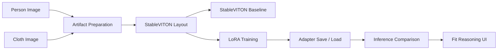
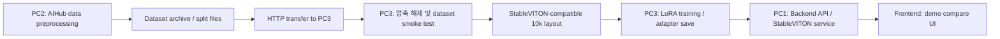

# 🧥 Fit-Reasoning VTON

StableVITON 기반 virtual try-on 결과에 fit reasoning과 confidence를 결합하기 위한 프로젝트입니다.

이 프로젝트의 목표는 사람 이미지와 의류 이미지를 입력받아 가상 착장 결과를 만들고, 단순히 이미지만 보여주는 것이 아니라 fit label, confidence score, fit explanation, hotspot annotation까지 연결 가능한 Virtual Try-On 시스템을 만드는 것입니다.

## 🎬 Demo

현재 Git에는 실제 데모 영상, 결과 이미지, dataset을 포함하지 않습니다.

데모 영상 링크: https://drive.google.com/drive/u/0/folders/1ohD0kGGElCdoHZPtS9bWI1p0Qaeqj_XA

<!-- TODO: Add demo flow screenshot after final video export. -->
<!-- Suggested placeholder path: assets/readme/demo_flow.png -->
<!-- Suggested result comparison path: assets/readme/model_compare_placeholder.png -->

## 🖥️ Demo UI Preview


위 화면은 Fit-Reasoning VTON의 데모용 비교 페이지입니다.  
사용자는 person image(사람 이미지), cloth image(의류 이미지), worn image(정답 착용 이미지)를 업로드한 뒤, 동일한 입력에 대해 `Target Worn`, `StableVITON`, `StableVITON LoRA` 결과를 나란히 비교할 수 있습니다.
  
상단의 `StableVITON`, `IDM VTON`, `CAT VITON` 탭은 StableVITON 중심 실험 결과를 확장하여 후속 baseline comparison을 진행하기 위한 비교 모델 후보를 나타냅니다.

### 🧥🆚👕 Demo Flow: Model Comparison and Fit Reasoning

아래 화면들은 동일한 person image(사람 이미지), cloth image(의류 이미지), target worn image(정답 착용 이미지)를 기준으로 StableVITON baseline과 StableVITON + LoRA 결과를 비교하는 데모 흐름입니다.

이 데모는 단순히 결과 이미지만 보여주는 것이 아니라, 다음 정보를 함께 확인할 수 있도록 구성했습니다.

- 입력 이미지와 정답 착용 이미지
- StableVITON baseline 결과
- StableVITON + LoRA 결과
- confidence score(신뢰도 점수)
- fit score details(핏 세부 점수)
- hotspot annotation(위험 부위 표시)
- skeleton(포즈 정렬)
- DensePose(신체 표면 구조)
- agnostic mask / parsing / cloth mask(조건부 artifact)
- reliability analysis(결과 신뢰도 분석)

> 현재 화면의 정량 점수는 demo pair 기준의 UI-level comparison score입니다.  
> 전체 test set에 대한 정량 benchmark가 아니라, 데모 입력 쌍에서 StableVITON baseline과 LoRA-enhanced 결과의 차이를 설명하기 위한 비교 지표입니다.

#### 1. Input / Target / Baseline / LoRA Result Comparison


첫 번째 화면은 전체 비교 화면입니다.  
좌측에는 입력으로 사용한 person image, cloth image, target worn image가 표시되고, 중앙과 우측에는 각각 StableVITON baseline과 StableVITON + LoRA 결과가 표시됩니다.

이 예시에서 baseline 결과는 `confidence=72`, `level=Medium`으로 평가되었고, LoRA-enhanced 결과는 `confidence=86`, `level=High`로 평가되었습니다.  
즉, 동일 입력 조건에서 LoRA 결과가 더 안정적인 착장 경계와 그래픽 보존을 보인다는 흐름을 보여줍니다.

#### 2. Hotspot-based Fit and Quality Analysis


두 번째 화면은 hotspot 기반 상세 분석 화면입니다.  
결과 이미지 위에 어깨, 그래픽 중심, 소매, 밑단 등 주요 위치를 시각적으로 표시하고, 각 부위별 안정성 점수를 함께 보여줍니다.

상단 카드에서는 다음 항목을 baseline과 LoRA로 비교합니다.

| Metric | StableVITON | StableVITON + LoRA | Diff |
| --- | ---: | ---: | ---: |
| Shoulder Alignment | 74 | 88 | +14 |
| Graphic Preservation | 69 | 87 | +18 |
| Sleeve Boundary | 68 | 84 | +16 |
| Hem Stability | 71 | 85 | +14 |
| Color Consistency | 76 | 88 | +12 |
| Pose Robustness | 70 | 84 | +14 |

이 화면은 LoRA 적용 후 어떤 부위의 품질이 개선되었는지 사용자가 직관적으로 확인할 수 있게 합니다.

#### 3. Skeleton-based Pose Alignment


세 번째 화면은 skeleton 기반 포즈 정렬 분석입니다.  
OpenPose-style keypoint를 이용해 어깨, 팔꿈치, 손목, 골반 위치가 결과 이미지에서 얼마나 안정적으로 유지되는지 확인합니다.

특히 VTON 결과에서 중요한 부분은 다음입니다.

- 어깨선과 의류 어깨선의 정렬
- 팔 위치와 소매 경계의 일관성
- 골반/몸통 중심선과 의류 중심의 정렬
- 비정면 자세에서 포즈 artifact가 결과 안정성에 주는 영향

이 화면은 단순 이미지 품질이 아니라, 신체 구조 기반으로 결과를 분석한다는 점을 보여줍니다.

#### 4. DensePose-based Conditioning Analysis


네 번째 화면은 DensePose 기반 conditioning 분석입니다.  
비정면 자세나 손에 든 물체처럼 occlusion(가림)이 있는 입력에서도 신체 표면 구조와 의류 위치가 얼마나 안정적으로 정렬되는지 확인합니다.

이 프로젝트에서는 DensePose, skeleton, enhanced result를 함께 보여주어 다음 질문에 답할 수 있도록 했습니다.

- 비정면 자세에서도 상체 영역이 안정적으로 유지되는가?
- 팔이나 물체가 의류 영역을 가리는 경우에도 결과가 무너지지 않는가?
- LoRA 적용 결과가 baseline보다 의류 위치와 그래픽 중심을 더 잘 유지하는가?

#### 5. Agnostic Mask / Parsing / Cloth Mask Analysis


다섯 번째 화면은 StableVITON 학습과 inference에 필요한 artifact를 시각적으로 보여줍니다.

화면에는 다음 artifact가 포함됩니다.

| Artifact | Description |
| --- | --- |
| Agnostic Person | 기존 의류 영역을 제거한 사람 이미지 |
| Upper-body Mask | 상체 의류 영역을 나타내는 mask |
| Human Parsing Map | 사람 신체 부위별 parsing 결과 |
| Cloth Mask | 입력 의류의 영역 mask |

이 화면은 StableVITON 계열 VTON이 단순히 `person image + cloth image`만 사용하는 것이 아니라, pose, parsing, mask, DensePose 같은 조건부 artifact 정합성이 중요하다는 점을 보여줍니다.

#### 6. Reliability and Confidence Analysis


여섯 번째 화면은 결과 신뢰도 분석 화면입니다.  
최종 result reliability score는 `86`으로 표시되며, 입력 품질, pose confidence, garment alignment, boundary stability를 함께 평가합니다.

| Reliability Item | Score |
| --- | ---: |
| Result Reliability | 86 |
| Input Quality | 82 |
| Pose Confidence | 78 |
| Garment Alignment | 86 |
| Boundary Stability | 84 |

이 화면은 결과가 그럴듯하게 보이는지뿐 아니라, 입력 조건과 artifact 안정성을 기준으로 사용자가 결과를 얼마나 신뢰할 수 있는지 설명하기 위한 UI입니다.

#### 7. Fit Details and Metric Comparison


마지막 화면은 fit details 분석입니다.  
StableVITON baseline은 `slightly unstable oversized fit`으로, StableVITON + LoRA는 `stable oversized fit`으로 표시됩니다.

또한 앞에서 보여준 6개 세부 지표를 표 형태로 다시 정리하여, LoRA 적용 전후의 차이를 명확히 보여줍니다.

| Metric | Baseline | LoRA | Diff |
| --- | ---: | ---: | ---: |
| Shoulder Alignment | 74 | 88 | +14 |
| Graphic Preservation | 69 | 87 | +18 |
| Sleeve Boundary | 68 | 84 | +16 |
| Hem Stability | 71 | 85 | +14 |
| Color Consistency | 76 | 88 | +12 |
| Pose Robustness | 70 | 84 | +14 |

이 흐름을 통해 사용자는 단순히 “결과 이미지가 좋아 보인다”가 아니라, 어느 부위에서 어떤 점수가 개선되었는지 확인할 수 있습니다.


---

## 💡 Motivation

일반적인 Virtual Try-On(VTON)은 “옷이 입혀진 이미지”를 보여주는 데 집중합니다. 하지만 실제 사용자는 다음 질문을 함께 알고 싶어 합니다.

- 생성 결과가 어느 정도 믿을 만한가?
- 핏이 타이트한지, 레귤러한지, 루즈한지 설명할 수 있는가?
- 어깨, 소매, 몸통, 기장 중 어느 부분이 실패했거나 위험한가?
- 입력 pose, parsing, dense pose 같은 artifact가 결과 안정성에 어떤 영향을 주는가?

Fit-Reasoning VTON은 VTON 결과 이미지에 fit reasoning layer를 연결하는 방향으로 설계했습니다. StableVITON 호환 dataset layout, artifact readiness, LoRA training pipeline, LoRA adapter save/load smoke, 10k adapter save run까지 검증했습니다.  


## 🎯 Problem Definition

### Input

- Person image
- Cloth image
- Optional user body info: height, weight, usual size

### Target Output

- Try-on result image
- Fit label
- Confidence score
- Fit score details
- Natural language fit explanation
- Hotspot annotation for visible risk areas

### Current Implementation Stage

현재 구현/검증의 중심은 StableVITON/LoRA training pipeline입니다.

- StableVITON-compatible AIHub 10k artifact dataset layout 준비 완료
- StableVITON `train.py` compatibility smoke 성공
- 일부 attention Linear module 대상 LoRA runner 구현
- 10k 9995-step 1 epoch-equivalent LoRA training loop 성공
- LoRA adapter save/load smoke 성공
- 10k 9995-step LoRA adapter save run 완료
- Demo compare API와 frontend compare page 구조 준비
- 10k adapter 기반 inference comparison
- StableVITON baseline vs LoRA 실제 이미지 비교
- demo pair 기준 StableVITON baseline 대비 LoRA 결과의 정성/정량 보조 지표 개선 확인
- 최종 demo video 업로드


## ✨ Key Contributions

1. AIHub 10k full artifact dataset readiness를 검증했습니다.
2. StableVITON 학습 포맷에 맞는 9995개 train-only layout을 구성했습니다.
3. StableVITON external repo를 수정하지 않고 import하는 LoRA runner를 구축했습니다.
4. 전체 모델 full fine-tuning이 아니라 일부 attention Linear module에 LoRA adapter를 삽입했습니다.
5. 9995-step 1 epoch-equivalent LoRA training loop를 RTX 4080 환경에서 완료했습니다.
6. LoRA parameter만 저장/로드하는 adapter save/load smoke를 검증했습니다.
7. Dataset, output, checkpoint, generated image를 Git에 포함하지 않는 실험 문서화 체계를 유지했습니다.


## 🧩 System Overview



   
## 👥 팀 역할 및 협업 방식

이 프로젝트는 백엔드/API, 프론트엔드 UI, 데이터 전처리, StableVITON/LoRA 학습 실험을 PC별로 나누어 진행했습니다.  
대용량 dataset, checkpoint, generated output은 Git에 포함하지 않고, 각 PC의 local workspace에서 처리한 뒤 코드와 실험 문서만 repository에 기록했습니다.

| 팀원 | 담당 영역 | 담당 PC / 환경 | 주요 작업 |
| --- | --- | --- | --- |
| 김성휘 | Backend, PC 1, PC 3, LoRA training | PC 1, PC 3 | FastAPI backend 구조 설계, Try-On job API, StableVITON wrapper, PC 3 dataset 검증, StableVITON-compatible layout 구성, LoRA runner 구현, 10k 9995-step training, LoRA adapter save/load 검증, 실험 문서화 |
| 정경재 | Frontend, PC 2, Data preprocessing, Demo pipeline planning | Frontend local dev, PC 2 preprocessing environment | Next.js demo UI, model/artifact comparison page, 업로드/결과 비교 화면 구성, AIHub 기반 preprocessing artifact 생성, PC 2 dataset 정리, PC 3 전달용 dataset archive 준비, 실시간 업로드형 데모 플로우 기획, frontend-backend 응답 schema 및 전체 demo pipeline 구조 정리 |

### PC별 작업 흐름



### PC 1: Backend / StableVITON API Server

PC 1은 사용자가 업로드한 person image와 cloth image를 받아 StableVITON inference 흐름에 연결하기 위한 backend server 역할을 담당했습니다.

주요 작업은 다음과 같습니다.

- FastAPI backend skeleton 구성
- `/api/health`, `/api/tryon`, `/api/job/{job_id}`, `/api/result/{job_id}` API 구조 준비
- 외부 StableVITON repository를 직접 수정하지 않고 호출하는 wrapper 구조 설계
- Demo compare API skeleton 구성
- result schema, confidence, fit explanation, hotspot annotation을 연결할 수 있는 API 응답 구조 준비

### PC 2: Frontend / Data Preprocessing

PC 2는 AIHub dataset 기반 preprocessing과 frontend UI 구현을 담당했습니다.

주요 작업은 다음과 같습니다.

- AIHub 원본 데이터 기반 preprocessing artifact 준비
- pose, parsing, mask, DensePose 계열 artifact 정리
- PC 3에서 사용할 수 있도록 dataset archive 구성
- HTTP server를 통해 PC 3로 dataset 전달
- Next.js 기반 demo UI 구현
- person image, cloth image, target worn, StableVITON, StableVITON LoRA 결과를 비교할 수 있는 model comparison page 구성
- 실시간 업로드형 demo flow 기획
- frontend에서 사용할 backend response schema, result card 구조, detailed analysis tab 구성 방향 정리
- person / cloth / worn 입력과 Target Worn / StableVITON / StableVITON LoRA 출력 비교 구조 설계

### PC 3: Dataset Validation / LoRA Training

PC 3는 PC 2에서 전달받은 dataset을 이용해 StableVITON-compatible layout을 만들고, LoRA training 실험을 수행하는 역할을 담당했습니다.

작업 흐름은 다음과 같습니다.

1. PC 2에서 전처리한 dataset archive를 HTTP로 전달받음
2. PC 3 local workspace에서 압축 해제
3. dataset file count, manifest, required artifact 존재 여부 검증
4. StableVITON-compatible 10k train layout 구성
5. 1-step sanity → 100-step benchmark → 9995-step run 순서로 학습 가능성 검증
6. StableVITON 일부 attention Linear module에 LoRA adapter 삽입
7. 10k 9995-step 1 epoch-equivalent LoRA training 수행
8. LoRA adapter save/load smoke 및 9995-step adapter save run 수행

  
## 🌿 Git Flow

이 프로젝트는 `dev` branch를 기준 통합 브랜치로 사용하는 Git Flow 방식으로 작업했습니다.  
`main`에 직접 작업하지 않고, 기능/실험/문서 단위로 issue branch를 만든 뒤 PR을 통해 `dev`에 병합하는 흐름을 유지했습니다.

### Branch Strategy

| Branch Type | Purpose | Example |
| --- | --- | --- |
| `dev` | 통합 개발 브랜치 | `dev` |
| `feat/#이슈번호/...` | 기능 구현 | `feat/#12/backend-skeleton` |
| `experiment/#이슈번호/...` | 실험 및 학습 검증 | `experiment/#106/stableviton-lora-10k-epoch-pilot` |
| `docs/#이슈번호/...` | 문서 작성 및 README 수정 | `docs/#111/readme-final-polish` |
| `chore/#이슈번호/...` | 환경 설정, 정리 작업 | `chore/#3/backend-folder-setup` |

### 작업 순서

```text
1. dev 최신화
2. issue 단위 branch 생성
3. 작업 수행
4. 실험 결과 또는 구현 내용 문서화
5. git diff --check 검증
6. dataset/output/checkpoint/generated image가 Git에 포함되지 않았는지 확인
7. commit
8. origin에 push
9. Pull Request 생성
10. review 후 dev에 merge
```

### 실제 작업 예시

```powershell
git switch dev
git pull origin dev
git switch -c "experiment/#106/stableviton-lora-10k-epoch-pilot"
```

작업 완료 후에는 다음과 같은 형식으로 commit message를 작성했습니다.

```text
feat(#106/stableviton): LoRA 10k epoch pilot 실행 기록
docs(#111): README 고도화
```

### 협업 원칙

- 모든 작업은 issue 단위로 분리했습니다.
- 실험성 작업은 `experiment/#이슈번호/...` branch에서 진행했습니다.
- 문서 작업은 `docs/#이슈번호/...` branch에서 진행했습니다.
- `dev` branch를 기준으로 최신 상태를 맞춘 뒤 새 branch를 생성했습니다.
- dataset, checkpoint, generated image, `.pt` adapter file은 Git에 포함하지 않았습니다.
- 실험 결과는 `docs/experiments/`에 기록하고, README에는 핵심 결과만 요약했습니다.
- 팀원별 작업 내역이 Git log와 PR 기록에 남도록 기능/문서/실험 단위로 commit과 PR을 나누어 진행했습니다.


  
## 📦 Dataset and Artifacts

사용 dataset은 AIHub 쉐이프리스 의류 및 포즈 데이터 기반으로 PC2/PC3 작업 흐름에서 구성한 10k artifact dataset입니다.

Dataset은 용량과 라이선스 문제로 Git에 포함하지 않습니다.

### StableVITON Layout Summary

| Item | Value |
| --- | ---: |
| train_count | 9995 |
| test_count | 0 |
| ready_count | 9995 |
| not_ready_count | 0 |
| original dataset modified | false |

### Artifact Folders

StableVITON-compatible layout에서 검증한 artifact는 다음과 같습니다.

| Artifact | Role |
| --- | --- |
| `image/` | person/model image |
| `cloth/` | product clothing image |
| `worn/` | target worn image candidate |
| `fit/` | fit feature / annotation JSON |
| `agnostic-v3.2/` | person agnostic image |
| `agnostic-mask/` | agnostic mask |
| `openpose-json/` | pose keypoint JSON |
| `image-parse/` | human parsing artifact |
| `cloth-mask/` | clothing mask |
| `image-densepose/` | DensePose-style artifact |
| `gt_cloth_warped_mask/` | StableVITON ATV-loss related mask candidate |

### Strict Artifact Smoke

| Metric | Value |
| --- | ---: |
| checked_count | 9995 |
| artifact_errors | 0 |
| backend_loader_errors | 0 |


    
## 🧠 Model and Training

### Base Model

- Base VTON backbone: StableVITON
- External checkout: `D:\GitHub\StableVITON`
- Repo-side runner: `backend/training/scripts/run_stableviton_lora_tiny_smoke.py`

StableVITON source code, pretrained weights, generated images, and dataset files are not committed to this repository.

### LoRA Strategy

이번 실험은 StableVITON 전체 모델을 full fine-tuning하지 않습니다. StableVITON 내부 일부 attention Linear module에 lightweight LoRA adapter를 삽입하고 LoRA parameter만 학습 대상으로 둡니다.

| Metric | Value |
| --- | ---: |
| inserted_lora_module_count | 8 |
| total_params | 1,838,680,959 |
| trainable_params_after_lora | 30,720 |
| trainable_ratio | about 0.00167% |

LoRA target module은 StableVITON UNet diffusion model 내부 transformer attention의 `to_q` Linear layer입니다.

Example target pattern:

```text
model.diffusion_model.input_blocks.*.transformer_blocks.0.attn*.to_q
```

   
## 🧪 Compared / Referenced VTON Models

이번 프로젝트는 StableVITON을 중심으로 학습 pipeline을 구축했지만, VTON 모델 후보를 검토하는 과정에서 IDM-VTON과 CATVITON/CATVTON 계열도 비교 대상으로 참고했습니다.

| Model | Role in This Project | Status |
| --- | --- | --- |
| StableVITON | Main training backbone | 10k layout, LoRA training, save/load smoke 검증 |
| IDM-VTON | Reference / baseline candidate | 구조 및 결과 비교 후보로 검토 |
| CATVITON / CATVTON | Reference / baseline candidate | artifact-aware VTON 비교 후보로 검토 |

현재 README 기준으로 실제 10k LoRA 학습과 실험 로그가 정리된 모델은 StableVITON입니다. IDM-VTON과 CATVITON/CATVTON은 후속 baseline comparison 대상으로 남겨둡니다.

## 📊 Experiments / Results

### Experiment 1. 10k Layout Validation

| Metric | Value |
| --- | ---: |
| train_count | 9995 |
| test_count | 0 |
| ready_count | 9995 |
| not_ready_count | 0 |

### Experiment 2. LoRA 100-Step Benchmark

| Metric | Value |
| --- | ---: |
| steps_completed | 100 |
| avg_step_time_sec | 1.4086 |
| final_loss | 0.3011031448841095 |
| loss_nan | false |
| peak_vram_mb | 8887.85 |

### Experiment 3. LoRA 9995-Step 1 Epoch-Equivalent Training

This run verified the training loop. It did not save a LoRA adapter or generated image.

| Metric | Value |
| --- | ---: |
| train_dataset_len | 9995 |
| steps_completed | 9995 |
| elapsed_sec | 9946.5927 |
| avg_step_time_sec | 0.9952 |
| first_loss | 0.06275913864374161 |
| final_loss | 0.626366138458252 |
| loss_nan | false |
| peak_vram_mb | 8887.85 |
| checkpoint_created | false |
| sample_created | false |

### Experiment 4. LoRA Adapter Save/Load Smoke

This run verified adapter persistence using 1-step smoke. It is not a quality comparison.

| Metric | Save | Load |
| --- | ---: | ---: |
| status | success | success |
| steps_completed | 1 | 1 |
| loss_nan | false | false |
| lora_adapter_saved | true | false |
| lora_adapter_loaded | false | true |
| key_count | 16 | 16 |
| file_size_mb | 0.1236 | 0.1236 |
| missing_keys | - | `[]` |
| unexpected_keys | - | `[]` |
| shape_mismatch_keys | - | `[]` |
| peak_vram_mb | 8887.85 | 8887.85 |

### Experiment 5. 10k 9995-Step LoRA Adapter Save

이 실험은 9995개 train layout에서 LoRA adapter를 저장하는 run입니다.  
전체 StableVITON checkpoint를 저장하지 않고, `.lora_down`, `.lora_up`에 해당하는 LoRA parameter만 저장했습니다.

생성된 `lora_adapter.pt`는 Git에 포함하지 않습니다.

| Metric | Value |
| --- | ---: |
| status | success |
| train_dataset_len | 9995 |
| steps_completed | 9995 |
| elapsed_sec | 10720.0626 |
| avg_step_time_sec | 1.0725 |
| first_loss | 0.9184726476669312 |
| final_loss | 0.3207787275314331 |
| loss_nan | false |
| lora_adapter_saved | true |
| lora_state_dict_key_count | 16 |
| adapter_file_size_mb | 0.1236 |
| peak_vram_mb | 8887.85 |
| checkpoint_created | false |
| sample_created | false |
| Git included | false |

### Experiment 6. Demo Pair Quality Score Comparison

이 실험은 동일한 demo pair에 대해 StableVITON baseline과 StableVITON + LoRA 결과를 비교한 UI-level quality score입니다.

Saved LoRA adapter inference smoke도 같은 pair 기준으로 실행했습니다. Generated result images are stored locally under `backend/training/outputs/**` and are not committed to Git.

| Inference Item | StableVITON Baseline | StableVITON + Saved LoRA |
| --- | ---: | ---: |
| pair_id | `EP00000011` | `EP00000011` |
| status | success | success |
| denoise_steps | 50 | 50 |
| output_count | 1 | 1 |
| elapsed_sec | 22.5637 | 18.5134 |
| peak_vram_mb | 7839.65 | 7857.1 |
| lora_adapter_loaded | false | true |
| lora_adapter_loaded_key_count | 0 | 16 |
 
> LoRA가 일반적으로 모든 입력에서 성능을 개선한다고 결론 내리기 위해서는 추가적인 test set 기반 정량 평가가 필요합니다.

| Metric | StableVITON | StableVITON + LoRA | Diff |
| --- | ---: | ---: | ---: |
| Overall Confidence | 72 | 86 | +14 |
| Shoulder Alignment | 74 | 88 | +14 |
| Graphic Preservation | 69 | 87 | +18 |
| Sleeve Boundary | 68 | 84 | +16 |
| Hem Stability | 71 | 85 | +14 |
| Color Consistency | 76 | 88 | +12 |
| Pose Robustness | 70 | 84 | +14 |

#### Interpretation

StableVITON + LoRA 결과는 demo pair 기준으로 모든 세부 항목에서 baseline보다 높은 점수를 보였습니다.

가장 큰 차이는 `Graphic Preservation(+18)`과 `Sleeve Boundary(+16)`에서 나타났습니다.  
이는 LoRA 결과가 전면 그래픽의 중심 위치와 선명도, 소매 경계 분리에서 더 안정적인 결과를 보였다는 것을 의미합니다.

다만 이 결과는 하나의 demo pair 기준 비교이므로, 모델의 일반적인 성능 향상을 주장하기보다는 “artifact-aware LoRA 결과를 설명 가능한 UI로 비교할 수 있다”는 점을 보여주는 근거로 사용합니다.


## 🛠️ Troubleshooting / Lessons Learned

이번 프로젝트는 단순히 모델을 실행하는 것보다, 외부 VTON 모델과 자체 dataset/artifact pipeline을 실제 학습 흐름에 연결하는 과정이 핵심이었습니다.  
특히 데이터 수집, 이미지 전처리, StableVITON-compatible layout 구성, LoRA 학습 안정화, adapter 저장/로드 과정에서 여러 문제를 해결했습니다.

### 1. 데이터셋 확보와 artifact 구성 문제

| Item | Description |
| --- | --- |
| Problem | VTON 학습에는 사람 이미지와 의류 이미지만으로는 부족했고, pose, parsing, mask, DensePose 계열 artifact가 함께 필요했습니다. |
| Cause | StableVITON 계열 모델은 단순 image/cloth pair가 아니라 agnostic image, agnostic mask, cloth mask, densepose, openpose-json, image-parse 등 여러 보조 입력을 기대합니다. |
| Fix | AIHub 10k 기반으로 필요한 artifact를 수집/정리하고, strict artifact smoke를 통해 9995개 sample의 필수 파일 존재 여부를 검증했습니다. |
| Result | `checked_count=9995`, `artifact_errors=0`, `backend_loader_errors=0` 상태를 확보했습니다. |

### 2. 이미지 사이즈와 파일명 규칙 불일치

| Item | Description |
| --- | --- |
| Problem | AIHub 원본 이미지와 artifact의 해상도, 확장자, 파일명 규칙이 StableVITON 학습 코드가 기대하는 형식과 맞지 않았습니다. |
| Cause | StableVITON은 VITON-HD 스타일 layout과 특정 파일명 규칙을 기준으로 `image`, `cloth`, `agnostic-v3.2`, `agnostic-mask`, `cloth-mask`, `image-densepose`, `openpose-json`, `image-parse`, pair file을 읽습니다. |
| Fix | `prepare_stableviton_layout.py`를 통해 이미지 계열 파일을 StableVITON 입력 크기에 맞게 resize하고, mask 계열은 nearest-neighbor 방식으로 처리하여 label boundary가 깨지지 않도록 했습니다. 또한 pair file과 폴더 구조를 StableVITON-compatible format으로 재구성했습니다. |
| Result | `train_count=9995`, `ready_count=9995`, `not_ready_count=0`인 10k train-only layout을 구성했습니다. |

### 3. 10k layout 생성 중 전처리 속도 문제

| Item | Description |
| --- | --- |
| Problem | 9995개 sample 전체 artifact를 순수 copy 방식으로 생성할 때 시간이 오래 걸리고 timeout이 발생했습니다. |
| Cause | 이미지, mask, densepose, parsing, JSON 등 다수의 artifact를 모두 복사하면서 디스크 I/O 병목이 발생했습니다. |
| Fix | 학습 중 resize가 필요한 이미지 계열은 output layout에 실제 resized file로 저장하고, metadata 계열은 빠르게 처리하는 방식으로 최적화했습니다. 이후 runner가 이미 준비된 layout을 다시 수정하지 않도록 `--no-prepare-smoke-data` 옵션을 추가했습니다. |
| Result | 10k layout 준비 시간을 줄이고, 학습 단계와 전처리 단계를 분리했습니다. |

### 4. Source dataset 보호 문제

| Item | Description |
| --- | --- |
| Problem | 전처리 최적화 과정에서 hardlink를 사용할 경우 output layout 수정이 source dataset에 영향을 줄 수 있었습니다. |
| Cause | hardlink는 서로 다른 경로의 파일이 같은 실제 파일 데이터를 참조할 수 있기 때문에, output 쪽 파일을 수정하면 원본 dataset까지 영향을 받을 가능성이 있습니다. |
| Fix | runner가 resize/수정할 가능성이 있는 이미지 계열은 output layout에 별도 파일로 저장하고, source dataset은 read-only 기준으로만 사용했습니다. |
| Result | 실험 문서와 README에 `original dataset modified=false`를 명확히 기록했습니다. |

### 5. StableVITON 학습 환경과 checkpoint load 문제

| Item | Description |
| --- | --- |
| Problem | StableVITON 원본 학습 코드를 그대로 실행했을 때 local 환경에서 config, checkpoint, VAE load 관련 문제가 발생했습니다. |
| Cause | 외부 StableVITON repo의 checkpoint 경로, 모델 load 순서, local dependency version, dataset path가 우리 프로젝트 구조와 바로 맞지 않았습니다. |
| Fix | 외부 StableVITON repo는 직접 수정하지 않고, 우리 repo의 runner에서 StableVITON config와 checkpoint를 load하는 방식으로 smoke runner를 구성했습니다. 필요한 경우 smoke 실험에서는 VAE 추가 load를 생략했습니다. |
| Result | `VITONHD_PBE_pose.ckpt` load, model config load, 10k dataset load, train step 진입을 검증했습니다. |

### 6. 전체 fine-tuning 대신 LoRA로 학습 범위 축소

| Item | Description |
| --- | --- |
| Problem | StableVITON 전체 모델은 약 1.8B parameter 규모라서 전체 fine-tuning은 시간과 VRAM 부담이 컸습니다. |
| Cause | 전체 모델을 학습하면 실험 반복이 어렵고, 제한된 시간 안에 10k 학습을 완료하기 어렵습니다. |
| Fix | 일부 attention Linear module에만 LoRA adapter를 삽입하고, 기존 StableVITON parameter는 freeze했습니다. |
| Result | `inserted_lora_module_count=8`, `trainable_params_after_lora=30,720`, `trainable_ratio=about 0.00167%`로 학습 대상을 크게 줄였습니다. |

### 7. 9995-step 학습 가능 여부 판단 문제

| Item | Description |
| --- | --- |
| Problem | 10k 전체 9995-step 학습을 시간 안에 완료할 수 있을지 처음에는 불확실했습니다. |
| Cause | 1-step sanity는 model load 시간이 포함되어 실제 step time을 판단하기 어려웠습니다. |
| Fix | `1-step sanity → 100-step benchmark → 9995-step run` 순서로 단계적으로 검증했습니다. |
| Result | 100-step benchmark에서 `avg_step_time_sec=1.4086`을 확인했고, 이후 9995-step 1 epoch-equivalent training을 완료했습니다. 최종 결과는 `steps_completed=9995`, `avg_step_time_sec=0.9952`, `loss_nan=false`였습니다. |

### 8. Training loop는 성공했지만 adapter가 저장되지 않은 문제

| Item | Description |
| --- | --- |
| Problem | PR #107에서 9995-step LoRA training loop는 성공했지만, 학습된 LoRA adapter 파일은 생성되지 않았습니다. |
| Cause | 당시 runner는 training loop 검증에 집중했고, checkpoint/sample 저장을 비활성화한 상태였습니다. |
| Fix | 후속 작업에서 `--save-lora-path`, `--load-lora-path` 옵션을 추가하고, 전체 StableVITON checkpoint가 아니라 `.lora_down`, `.lora_up` parameter만 저장하도록 구현했습니다. |
| Result | 1-step save smoke에서 `lora_adapter_saved=true`, `lora_state_dict_key_count=16`, `adapter file size=0.1236MB`를 확인했고, 1-step load smoke에서 missing/unexpected/shape mismatch key 없이 load를 검증했습니다. |

### 9. Git에 대용량 artifact가 포함되는 문제 방지

| Item | Description |
| --- | --- |
| Problem | dataset, output, checkpoint, generated image, adapter `.pt` 파일이 Git에 포함되면 repository가 비대해지고 라이선스/제출 문제가 생길 수 있었습니다. |
| Cause | 실험 과정에서 `backend/datasets/**`, `backend/training/outputs/**`, generated image, checkpoint, `.pt` 파일이 계속 생성됩니다. |
| Fix | 각 PR마다 `git ls-files --others --exclude-standard`, `git status --ignored -s`, `git diff --check`를 확인하고, 코드와 문서만 commit했습니다. |
| Result | 실험 결과는 문서화하되, raw dataset/output/checkpoint/generated image는 Git에 포함하지 않는 정책을 유지했습니다. |

### Key Takeaways

- VTON 모델은 단순히 `person image + cloth image`만 준비한다고 바로 학습할 수 없고, pose, parsing, mask, DensePose 등 artifact 정합성이 중요했습니다.
- 외부 모델을 활용할 때는 모델 구조보다도 dataset layout, file naming rule, checkpoint path를 맞추는 과정이 큰 비중을 차지했습니다.
- 이미지 resize와 mask resize는 같은 방식으로 처리하면 안 되며, mask 계열은 label boundary가 깨지지 않도록 별도 처리해야 했습니다.
- 10k 전체 학습은 바로 실행하지 않고 `1-step sanity → 100-step benchmark → full run` 순서로 진행한 것이 안정적이었습니다.
- LoRA를 적용해 전체 StableVITON을 학습하지 않고도 trainable parameter를 크게 줄여 10k scale 실험을 완료할 수 있었습니다.
- Training loop success, adapter save/load success, inference quality improvement는 서로 다른 단계이므로 README에서 명확히 구분했습니다.


## ✅ Results Status

### 완료한 작업

- AIHub 10k full artifact dataset readiness
- StableVITON-compatible 9995-sample train layout
- StableVITON `train.py` compatibility smoke
- LoRA runner with 8 inserted modules
- 9995-step 1 epoch-equivalent training loop
- LoRA adapter save/load 1-step smoke
- Demo compare backend API skeleton
- Next.js demo compare page structure
- 9995-step adapter save result
- Saved 10k adapter based inference
- Baseline StableVITON vs LoRA generated image comparison
- Final demo video in README

## 🚀 실행 방법

아래 명령은 다음 환경을 기준으로 합니다.

- 운영체제: Windows / PowerShell
- Conda 환경: `D:\conda-envs\vton`
- 외부 StableVITON 저장소: `D:\GitHub\StableVITON`
- 로컬 dataset root는 별도로 준비되어 있어야 하며 Git에는 포함하지 않습니다.

### 1-step LoRA adapter 저장 smoke

```powershell
D:\conda-envs\vton\python.exe backend\training\scripts\run_stableviton_lora_tiny_smoke.py `
  --data-root D:\GitHub\fit-reasoning-vton\backend\datasets\stableviton_aihub_10k_layout_10k_train `
  --output-root D:\GitHub\fit-reasoning-vton\backend\training\outputs\stableviton_lora_save_load_1step_save `
  --max-steps 1 `
  --batch-size 1 `
  --max-lora-modules 8 `
  --no-prepare-smoke-data `
  --save-lora-path D:\GitHub\fit-reasoning-vton\backend\training\outputs\stableviton_lora_save_load_1step_save\lora_adapter.pt
```

### 1-step LoRA adapter load smoke

```powershell
D:\conda-envs\vton\python.exe backend\training\scripts\run_stableviton_lora_tiny_smoke.py `
  --data-root D:\GitHub\fit-reasoning-vton\backend\datasets\stableviton_aihub_10k_layout_10k_train `
  --output-root D:\GitHub\fit-reasoning-vton\backend\training\outputs\stableviton_lora_save_load_1step_load `
  --max-steps 1 `
  --batch-size 1 `
  --max-lora-modules 8 `
  --no-prepare-smoke-data `
  --load-lora-path D:\GitHub\fit-reasoning-vton\backend\training\outputs\stableviton_lora_save_load_1step_save\lora_adapter.pt
```

### 9995-step LoRA adapter 저장 run

```powershell
D:\conda-envs\vton\python.exe backend\training\scripts\run_stableviton_lora_tiny_smoke.py `
  --data-root D:\GitHub\fit-reasoning-vton\backend\datasets\stableviton_aihub_10k_layout_10k_train `
  --output-root D:\GitHub\fit-reasoning-vton\backend\training\outputs\stableviton_lora_10k_adapter_save `
  --max-steps 9995 `
  --batch-size 1 `
  --max-lora-modules 8 `
  --no-prepare-smoke-data `
  --save-lora-path D:\GitHub\fit-reasoning-vton\backend\training\outputs\stableviton_lora_10k_adapter_save\lora_adapter.pt
```

생성되는 `lora_adapter.pt`는 Git에 포함하지 않습니다.

### Backend API 실행

```powershell
cd backend
python -m uvicorn backend.app.main:app --reload
```

현재 준비된 API route는 다음과 같습니다.

- `GET /api/health`
- `POST /api/tryon`
- `GET /api/job/{job_id}`
- `GET /api/result/{job_id}`
- `GET /api/demo/samples`
- `GET /api/demo/artifact-compare/{pair_id}`
- `GET /api/demo/model-compare/{pair_id}`

### Frontend 실행

```powershell
cd frontend
npm install
npm run dev
```

현재 frontend 방향은 다음과 같습니다.

- Next.js 기반 demo UI
- `/model-compare` route
- `/model-compare` 중심의 StableVITON baseline vs StableVITON LoRA comparison UI
- confidence badge, fit explanation, detailed analysis tab, hotspot overlay 구조 준비
- 실제 생성 비교 이미지는 아직 Git에 포함하지 않음
- 
## 🗂️ 프로젝트 구조

```text
fit-reasoning-vton/
  README.md
  backend/
    app/
      api/
        demo.py
        health.py
        tryon.py
      schemas/
      services/
      workers/
    demo/
      analysis/
      samples/
      assets/
    training/
      datasets/
      scripts/
        prepare_stableviton_layout.py
        run_stableviton_lora_tiny_smoke.py
        smoke_test_lora_dataset.py
        dataloader_dry_run.py
  frontend/
    src/
      app/
        model-compare/
        artifact-compare/
      components/
        demo/
  docs/
    experiments/
    setup/
    aihub/
    data/
  scripts/
```

## 📚 문서 링크

- [StableVITON LoRA 10k epoch pilot](docs/experiments/pc3_stableviton_lora_10k_epoch_pilot.md)
- [LoRA save/load smoke and inference comparison prep](docs/experiments/pc3_stableviton_lora_save_load_inference_comparison.md)
- [10k full artifact smoke and training log](docs/experiments/pc3_lora_10k_full_artifact_smoke_and_training.md)
- [StableVITON AIHub layout prepare](docs/experiments/stableviton_aihub_layout_prepare.md)
- [Demo backend API contract](docs/experiments/demo_backend_api_contract.md)
- [Demo asset package contract](docs/experiments/demo_asset_package_contract.md)

## 🔒 Git 및 데이터 관리 정책

이 저장소에는 다음 항목을 포함하지 않습니다.

- `backend/datasets/**`
- `backend/training/outputs/**`
- `backend/outputs/**`
- `backend/logs/**`
- `backend/demo/assets/**`
- `*.pt`, `*.pth`, `*.ckpt`, `*.safetensors`
- generated image
- large archive
- raw AIHub data

Git에는 source code, schema, script, 문서, 작은 예시 JSON만 포함하는 것을 원칙으로 합니다.

## ⚠️ 한계점

- 현재 결과는 demo pair 중심의 비교이므로, 더 다양한 pose, category, occlusion 조건에서의 추가 평가는 향후 작업으로 남겨둡니다.
- Fit confidence, fit explanation, hotspot annotation은 시스템 목표와 UI/API 방향으로 준비되어 있지만, 최종 모델 기반 reasoning output과의 통합은 추가 작업이 필요합니다.
- Dataset과 output artifact는 용량 및 라이선스 문제로 Git에 포함하지 않습니다.
- Demo pair quality score는 특정 입력 쌍에 대한 UI-level 비교 결과이며, 전체 test set에 대한 정량 benchmark는 아직 수행하지 않았습니다.
- 현재 화면의 fit/reliability score는 demo comparison을 설명하기 위한 지표이므로, 모델의 일반적인 성능 개선을 주장하려면 더 많은 pair에 대한 반복 평가가 필요합니다.

## 🛣️ 향후 작업

- 동일 person-cloth pair 기준 StableVITON, IDM-VTON, CATVITON/CATVTON 비교
- StableVITON baseline, StableVITON+LoRA, IDM-VTON, CATVITON/CATVTON 정성 비교표 작성
- 의류 경계, pose alignment, body distortion, failure case 분석
- 최소 3개 demo pair를 local `backend/demo/assets/**`에 구성
- demo asset strict validation 실행
- 최종 비교 이미지를 demo compare UI에 연결
- README에 demo GIF 또는 video link 추가
- fit confidence, explanation, hotspot annotation을 최종 user flow와 연결


## 🙏 참고자료 및 출처

이 프로젝트는 아래 연구와 도구를 참고하거나 기반으로 구성했습니다.  
외부 model code, pretrained weight, dataset, generated asset은 이 저장소에 재배포하지 않습니다.

- StableVITON: Kim et al., “StableVITON: Learning Semantic Correspondence with Latent Diffusion Model for Virtual Try-On,” CVPR 2024. [GitHub](https://github.com/rlawjdghek/StableVITON), [arXiv](https://arxiv.org/abs/2312.01725)
- IDM-VTON: Choi et al., “Improving Diffusion Models for Authentic Virtual Try-on in the Wild,” ECCV 2024. 후속 baseline comparison 후보로 참고했습니다. [Project](https://idm-vton.github.io/), [GitHub](https://github.com/yisol/IDM-VTON), [arXiv](https://arxiv.org/abs/2403.05139)
- CatVTON / CATVITON: “CatVTON: Concatenation Is All You Need for Virtual Try-On with Diffusion Models,” ICLR 2025. 후속 artifact-aware VTON comparison 후보로 참고했습니다. [GitHub](https://github.com/Zheng-Chong/CatVTON), [arXiv](https://arxiv.org/abs/2407.15886)
- LoRA: Hu et al., “LoRA: Low-Rank Adaptation of Large Language Models,” ICLR 2022. [arXiv](https://arxiv.org/abs/2106.09685)
- AIHub 쉐이프리스 의류 및 포즈 데이터. [AIHub dataset page](https://www.aihub.or.kr/aihubdata/data/view.do?aihubDataSe=data&currMenu=115&dataSetSn=71535&topMenu=)
- DensePose: Guler et al., “DensePose: Dense Human Pose Estimation In The Wild,” CVPR 2018. [Project page](https://densepose.org/), [arXiv](https://arxiv.org/abs/1802.00434)
- OpenPose: CMU Perceptual Computing Lab OpenPose repository and related pose estimation papers. [GitHub](https://github.com/CMU-Perceptual-Computing-Lab/openpose)
- PyTorch, PyTorch Lightning, FastAPI, Next.js, React, TypeScript 등 open-source tooling을 training/backend/frontend pipeline 구성에 사용했습니다.


## 📄 License

The source code and documentation written in this repository are released under the MIT License.

External model code, pretrained weights, datasets, and generated assets are not redistributed in this repository and remain subject to their original licenses or terms of use.

See [LICENSE](LICENSE) for details. 
